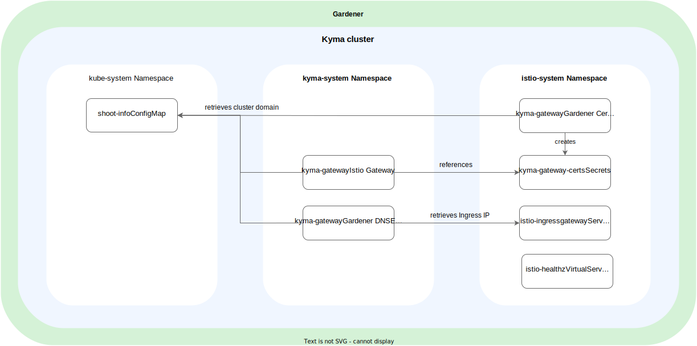

# APIGateway Kyma Gateway

The Kyma Gateway can be enabled or disabled by the [APIGateway CR](../user/custom-resources/apigateway/04-00-apigateway-custom-resource-avoid-conflict.md). By default, the Kyma Gateway is enabled.
Depending on the Kubernetes cluster, the Kyma Gateway is configured different. The configuration of the Kyma Gateway depends on whether it is used on a managed Kyma cluster or open source.

## Managed Kyma
In a managed Kyma cluster, the Kyma Gateway uses the Gardener Shoot domain. For this domain, an Istio Gateway CR exposes the HTTPS port (443) and the HTTP port (80) with a redirect to port 443.  
Additionally, the Istio Gateway uses a certificate managed by a Gardener Certificate CR. The Gardener DNSEntry CR creates a DNS record for the specified domain with the Istio Ingress Gateway Load Balancer Service as the target.

## Open source
In an open source Kyma cluster, the Kyma Gateway uses the domain `local.kyma.dev`. For this domain, an Istio Gateway CR is created that exposes the HTTPS port (443) and the HTTP port (80) with a redirect to port 443.
The Istio Gateway uses a default certificate for the domain `local.kyma.dev`, that is valid until July 2030.

