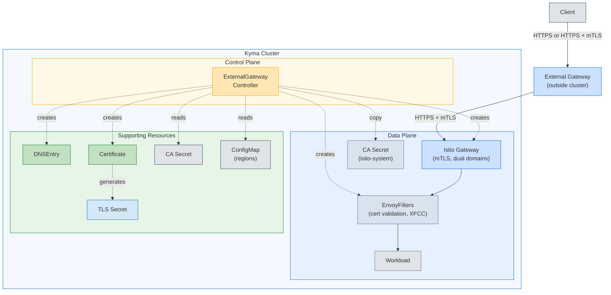
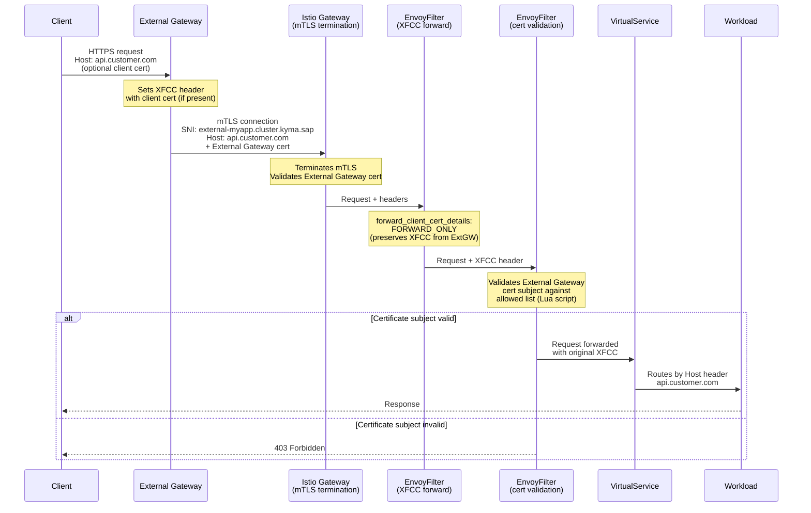

# External Gateway

## Status

Proposed

## Context

Kyma API Gateway enables workload exposure through Istio-based routing using `APIRule` custom resources. For certain deployment scenarios, customers need to expose applications through external gateways (outside the cluster) while maintaining Kyma-managed internal domains for cluster operations.

### Why External Gateway?

External gateways sit outside Kyma clusters and provide:
- **Centralized traffic management** across multiple clusters
- **Regional routing** to direct traffic to appropriate cluster instances
- **Additional security layers** (WAF, DDoS protection) before traffic reaches the cluster
- **CDN integration** for content caching and acceleration
- **Customer-facing domains** that remain stable across cluster migrations

This introduces technical challenges:
- **Domain fronting:** External traffic uses external domain in `Host` header but internal domain for TLS SNI
- **mTLS validation:** External gateway establishes mTLS connection to Kyma requiring certificate validation
- **Certificate preservation:** External gateway technical certificate must not override client certificate information forwarded to workloads (when client uses mTLS)
- **Multi-region support:** Different regions use different certificate authorities requiring region-specific validation

## Decision

We introduce `ExternalGateway` CRD that automates external gateway integration by creating and managing Istio and Gardener resources.

### Architecture Overview



### Component Responsibilities

**ExternalGateway CR (User-facing API):**
- `spec.externalDomain` - Customer-facing domain (supports wildcards)
- `spec.internalDomain.kymaSubdomain` - Internal domain prefix
- `spec.region` - Region identifier for certificate validation
- `spec.regionsConfigMap` - ConfigMap with region metadata
- `spec.caSecretRef` - Secret containing CA certificate

**Controller (Automation):**
1. Reads region metadata from ConfigMap
2. Generates internal domain: `{kymaSubdomain}.{KYMA_DOMAIN}`
3. Creates `DNSEntry` for internal domain (Gardener DNS)
4. Creates `Certificate` for internal domain (Gardener certificate management)
5. Creates Istio `Gateway` with mTLS, accepting both external and internal domains
6. Copies CA Secret to `istio-system` for mTLS validation
7. Creates two `EnvoyFilter` resources: one for XFCC forwarding, one for certificate validation

**Istio Gateway:**
- Hosts: both external and internal domains
  - External domain for client-facing traffic (e.g., `api.customer.com`)
  - Internal domain for TLS termination (e.g., `external-myapp.cluster.kyma.local`)
  - Enables domain fronting: external gateway uses internal domain for SNI/certificate, preserving customer domain in `Host` header
- TLS: mTLS mode `MUTUAL` - validates external gateway certificate
- Terminates mTLS from external gateway
- Routes based on `Host` header (domain fronting)

**EnvoyFilters (Two-layer validation):**
1. **XFCC Forwarding:** Configures `forward_client_cert_details: FORWARD_ONLY` to preserve existing XFCC header from external gateway
2. **Certificate Validation:** Lua script validates certificate subject against allowed list from region ConfigMap

### Traffic Flow



### Implementation Details

**Domain Fronting (Default):**
- Istio Gateway `hosts`: both external + internal domains
- TLS SNI: internal domain
- HTTP `Host` header: external domain
- VirtualService routes on `Host` header

**Certificate Validation (Two-layer):**

*Layer 1 - TLS Handshake:*
- Gateway configured with mTLS `MUTUAL` mode
- CA Secret validates external gateway certificate (cryptographic trust)
- Rejects non-trusted external gateway certificates at TLS level

*Layer 2 - EnvoyFilter:*
- Lua script validates external gateway certificate subject against allowed list
- Allowed subjects extracted from ConfigMap per region
- Provides authorization layer - rejects certificates from unauthorized regions

**XFCC Header Preservation:**
- **EnvoyFilter:** Configures native Envoy `forward_client_cert_details: FORWARD_ONLY`
- **Behavior:** Forwards existing XFCC header from external gateway without modification
- **Use case:** When client uses mTLS to external gateway, original client certificate information is preserved
- **Result:** Workload receives original client certificate information (if present), NOT external gateway technical certificate

### APIRule Integration

`APIRule` uses existing `spec.gateway` or `spec.externalGateway` field (mutually exclusive):

```yaml
apiVersion: gateway.kyma-project.io/v1alpha1
kind: ExternalGateway
metadata:
  name: my-app
  namespace: my-namespace
spec:
  externalDomain: api.customer.com
  internalDomain:
    kymaSubdomain: external-myapp
  region: eu10
  regionsConfigMap: external-gateway-regions
  caSecretRef:
    name: ca-certificate
---
apiVersion: gateway.kyma-project.io/v2alpha1
kind: APIRule
metadata:
  name: my-api
  namespace: my-namespace
spec:
  externalGateway: my-namespace/my-app
  hosts:
    - api.customer.com
  service:
    name: my-service
    port: 8080
  rules:
    - path: /api/{**}
      methods: [GET, POST]
      noAuth: true
```

## Consequences

**Benefits:**
- **Automation:** Controller manages all Istio and Gardener resources automatically
- **Security:** Two-layer certificate validation (cryptographic trust + subject authorization)
- **Decoupling:** External gateway configuration independent of routing rules
- **Integration:** Works with existing `APIRule` without breaking changes
- **Isolation:** EnvoyFilters scoped per external gateway - no cross-gateway impact

**Trade-offs:**
- **New CRD:** Additional API surface to maintain
- **Istio dependency:** EnvoyFilters tightly coupled to Istio
- **Gardener dependency:** Relies on Gardener DNSEntry and Certificate resources
- **ConfigMap management:** External metadata must be provisioned and maintained

**Neutral:**
- **Alpha phase:** Feature released as `v1alpha1` for iteration
- **Single region:** MVP supports one region per ExternalGateway
