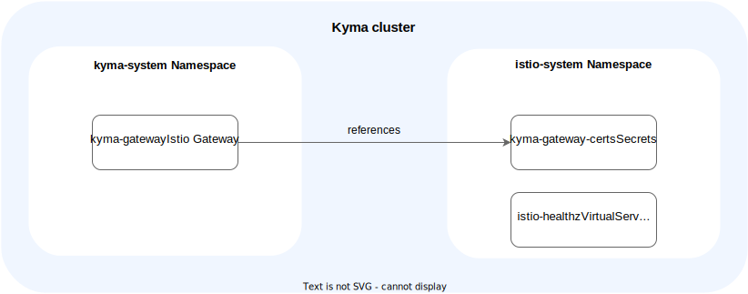

# APIGateway Kyma Gateway

The Kyma Gateway can be enabled or disabled by the [APIGateway CR](04-00-apigateway-custom-resource-avoid-conflict.md). By default, the Kyma Gateway is enabled.  
The Kyma Gateway is an [Istio Gateway CR](https://istio.io/latest/docs/reference/config/networking/gateway/) with the name `kyma-gateway` in the `kyma-system` Namespace. The Istio Gateway describes which ports and protocols should be exposed for a domain.
Depending on the Kubernetes cluster, the Kyma Gateway is configured different. The configuration of the Kyma Gateway depends on whether it is used on a managed Kyma cluster or open source.

## Managed Kyma
In a managed Kyma cluster, the Kyma Gateway uses the Gardener Shoot domain. For this domain, an Istio Gateway CR exposes the HTTPS port (443) and the HTTP port (80) with a redirect to port 443.  
Additionally, the Istio Gateway uses a certificate managed by a [Gardener Certificate CR](https://gardener.cloud/docs/guides/networking/certificate-extension/#using-the-custom-certificate-resource). 
The Gardener [DNSEntry CR](https://gardener.cloud/docs/guides/networking/dns-extension/#creating-a-dnsentry-resource-explicitly) creates a DNS record for the specified domain with the Istio Ingress Gateway Load Balancer Service as the target.

## Open source
In an open source Kyma cluster, the Kyma gateway uses the domain `local.kyma.dev`. For this domain, an Istio Gateway CR exposes the HTTPS port (443) and the HTTP port (80) with a redirect to port 443.
The Istio gateway uses a default certificate for the domain `local.kyma.dev` that is valid until July 2030.

## Disabling Gateway
The Kyma Gateway is disabled by removing the `enableKymaGateway` field in the [APIGateway CR](04-00-apigateway-custom-resource-avoid-conflict.md) or setting it to `false`.  
The Kyma Gateway can be disabled only if no APIRules are configured on the cluster.
